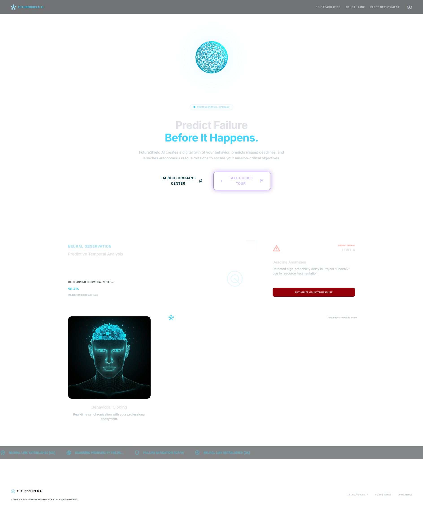
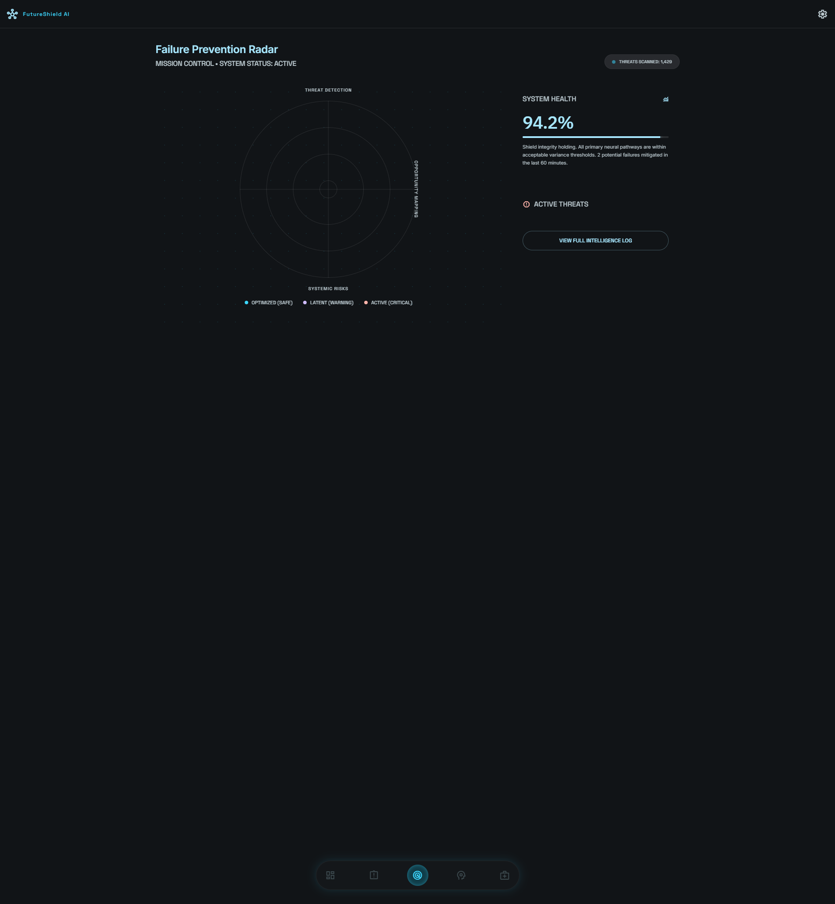
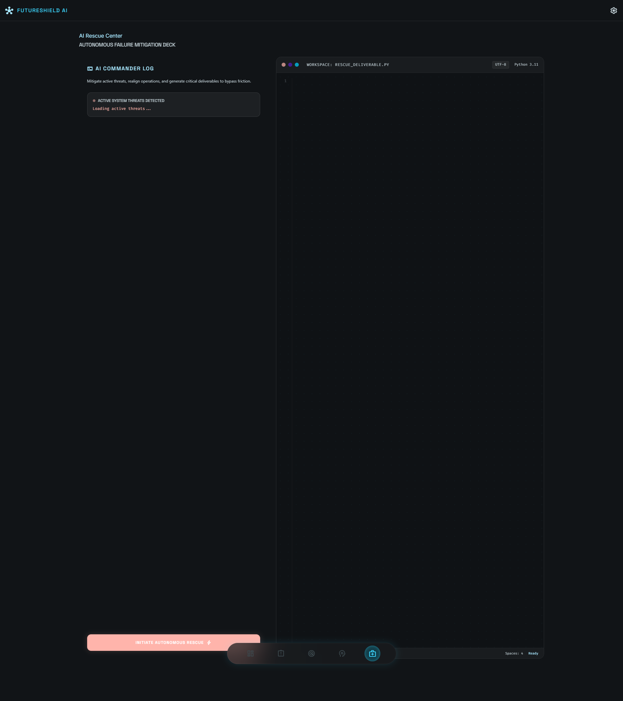
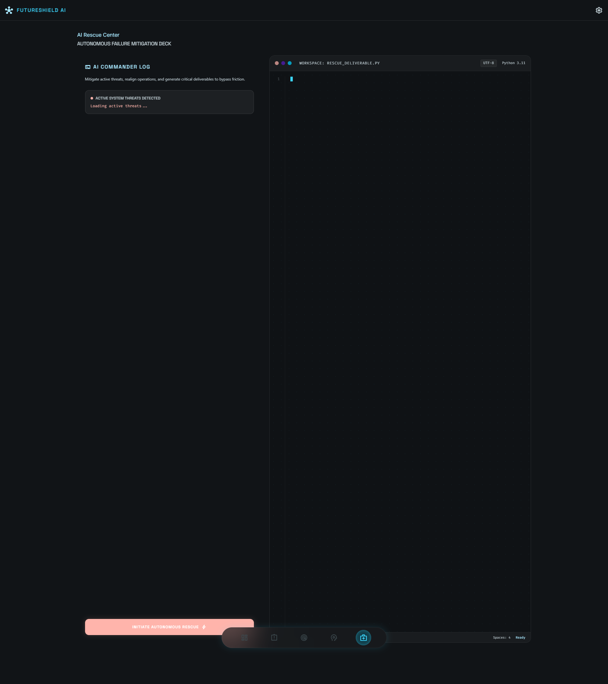
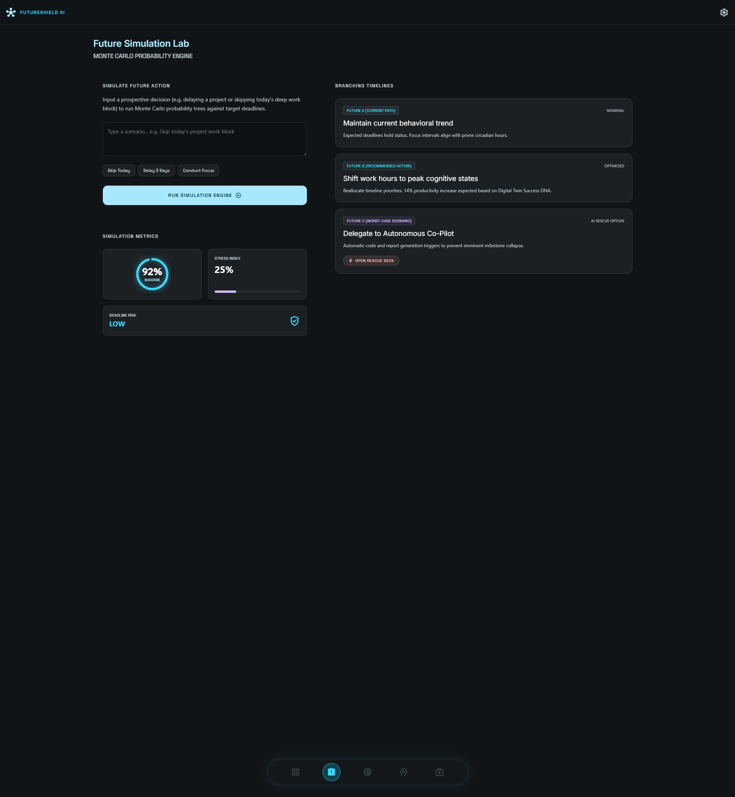
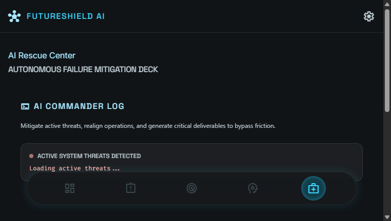

# FutureShield AI 🛡️

> **Predict Failure Before It Happens.** A premium, immersive Failure Prevention Operating System designed like a personal command center.

[](https://python.org)
[](https://fastapi.tiangolo.com)
[](https://tailwindcss.com)
[](https://ai.google.dev)
[](https://docker.com)
[](https://cloud.google.com/run)

---

## 📋 Table of Contents

- [Screenshots](#-screenshots)
- [Overview](#-overview)
- [Key Features](#-key-features)
- [Tech Stack](#-tech-stack)
- [Quick Start](#-quick-start)
- [Demo Walkthrough](#-demo-walkthrough)
- [AI Integration](#-ai-integration)
- [API Reference](#-api-reference)
- [Testing](#-testing)
- [Deployment](#-deployment)
- [Project Structure](#-project-structure)

---

## 🖥️ Screenshots

<div align="center">
  
  
</div>

<div align="center">
  
  
</div>

<div align="center">
  
  
</div>

---

## 🎯 Overview

**FutureShield AI** tackles **Problem Statement 1: The Last-Minute Life Saver** for the Vibe2Ship Hackathon.

High-performers, developers, and students face cognitive overload when managing complex deadlines. Traditional tools rely on passive push notifications that are easily snoozed or ignored. FutureShield AI is different — it actively monitors your work, predicts failure risks, simulates branching outcomes, and launches autonomous rescue missions.

### How It Works

1. **Predicts Failures** → Analyzes active tasks against target deadlines to calculate real-time risks
2. **Simulates Scenarios** → Models branching timelines ("What if I skip today's work?") via Gemini AI
3. **Launches AI Rescue Missions** → Co-builds and drafts deliverables using AI to bypass startup friction
4. **Syncs with a Digital Twin** → Tracks energy, focus, and burnout cycles in real-time

---

## ✨ Key Features

### 🎮 Executive Command Center
An air-traffic-control-style dashboard with live success scores, radar threat detection, system telemetry, and global node status.

### 🔍 Failure Prevention Radar
Real-time threat detection radar with pulsing blips for active deadlines. Scan, identify, and resolve risks before they cascade.

### 🔮 Future Simulation Lab
Interactive branching timeline visualization powered by Gemini AI. Forecast three futures:
- **Future A**: Current path
- **Future B**: Optimized recommended path  
- **Future C**: AI Rescue intervention

### 🧬 Holographic Digital Twin
Real-time diagnostics with energy waveform visualization, focus patterns, behavior scoring, and Success DNA analysis.

### 🚑 AI Rescue Center
Split-pane IDE workspace where AI generates code, documents, and recovery plans. Features character-by-character typing animation with confetti celebration on completion.

### 🧠 Knowledge & Dependency Graph
Fully pannable, zoomable, and draggable force-directed SVG graph mapping relationships between goals, threats, skills, and systems.

### 📅 Smart AI Calendar
Daily timeline grid with Deep Work intervals, meetings, break periods, and risk zone highlighting. Shows current time indicator and daily stats.

### 🎤 Voice Pilot Assistant
Floating orb with Web Speech API integration. Speak commands:
- *"start focus"* → Activate deep work protocol
- *"what is next"* → Get your next priority
- *"show dashboard/radar/twin/rescue"* → Navigate instantly
- *"stop listening"* → Deactivate

### 🎨 Visual Highlights
- Premium Obsidian Dark Theme with cyan accent
- Glassmorphism panels with backdrop blur
- WebGL neural network background shader (60 FPS)
- Three.js 3D icosahedron orb on landing page
- Animated radar sweeps and pulsing indicators
- SVG force-directed graph with particle system
- Responsive design (mobile-first bottom nav)

---

## 🛠️ Tech Stack

| Layer | Technology |
|-------|-----------|
| **Frontend** | Vanilla HTML5 + Tailwind CSS + JavaScript (WebGL, Three.js, Canvas, SVG) |
| **Backend** | Python 3.11+ with FastAPI |
| **Database** | SQLite (zero-dependency, embedded) |
| **AI** | Google Gemini 2.5 Flash via REST API |
| **Vector Store** | ChromaDB (local, persistent, RAG-powered) |
| **CI/CD** | GitHub Actions (test, lint, Docker build, deploy) |
| **Infrastructure** | Docker + Google Cloud Run |

---

## 🚀 Quick Start

### Prerequisites
- Python 3.11+
- GEMINI_API_KEY ([get one free](https://aistudio.google.com/apikey))

### 1. Clone & Setup
```bash
git clone <repo-url>
cd FutureShieldAI

# Create virtual environment
python -m venv venv
source venv/bin/activate  # Linux/Mac
# venv\Scripts\activate   # Windows

# Install dependencies
pip install -r requirements.txt
```

### 2. Configure Environment
```bash
cp .env.example .env
# Edit .env and add your Gemini API key:
# GEMINI_API_KEY=your_key_here
```

### 3. Run the App
```bash
# Option A: Direct Python
uvicorn main:app --host 0.0.0.0 --port 8080 --reload

# Option B: Docker
docker-compose up --build
```

> **Note on RAG:** On first startup, the app downloads a lightweight embedding model (~80MB) for vector search via ChromaDB. The app works perfectly without it — RAG is an enhancement that **gracefully degrades** if ChromaDB is unavailable.

### 4. Open in Browser
Navigate to [http://localhost:8080](http://localhost:8080)

---

## 🎬 Demo Walkthrough

1. **Landing Page** (`/`): Start at the mission control with the floating Three.js orb. Click "LAUNCH COMMAND CENTER"
2. **Dashboard** (`/dashboard.html`): View live success score, radar centerpiece, system telemetry, goal hub, knowledge graph, and AI calendar
3. **Threat Radar** (`/radar.html`): See active threats plotted on radar with pulsing indicators. Hover for details
4. **Future Simulation** (`/simulation.html`): Type a scenario (e.g., "Skip today's work block") and run the simulation engine
5. **Digital Twin** (`/twin.html`): View behavior score, energy waveform, focus patterns, and Success DNA
6. **AI Rescue** (`/rescue.html`): Click "INITIATE AUTONOMOUS RESCUE" to generate AI code with typing animation
7. **Voice Pilot**: Tap the floating orb anywhere to activate voice commands

---

## 🤖 AI Integration

FutureShield AI integrates **Google Gemini 2.5 Flash** via REST API at three touchpoints:

| Feature | Endpoint | What Gemini Does |
|---------|----------|-----------------|
| **Goal Architect** | `POST /api/goals/decompose` | Decomposes high-level goals into 3 actionable milestones with dates |
| **Simulation Engine** | `POST /api/simulate` | Generates 3 branching future timelines with probabilities and risks |
| **AI Rescue** | `POST /api/rescue` | Creates recovery plans and generates technical code/assets |

All AI features include **robust fallback logic** — the app works fully in demo mode without an API key.

### 🧠 Retrieval-Augmented Generation (RAG)

FutureShield now includes **RAG** via ChromaDB to make AI responses more context-aware:

**How it works:**
1. **Indexing**: On startup, all goals, threats, focus sessions, and energy records are embedded into ChromaDB (a local vector store)
2. **Retrieval**: Before each AI call, the system queries the vector store for semantically similar past data
3. **Augmentation**: Retrieved context is injected into the Gemini prompt, grounding the AI in real user history
4. **Continuous update**: New goals and resolved threats are indexed in real-time

**Where RAG is used:**

| Endpoint | What's Retrieved | Benefit |
|----------|-----------------|---------|
| `POST /api/goals/decompose` | Similar past goals & milestones | More realistic, context-aware decomposition |
| `POST /api/simulate` | Current goals, threats, focus patterns | Simulations grounded in actual user state |
| `POST /api/rescue` | Similar past threats & resolutions | Recovery plans informed by history |
| `POST /api/summary` | Historical context across all data types | Deeper, more personalized insights |

The RAG engine is designed to **degrade gracefully** — if ChromaDB is not installed or fails, all endpoints continue working with their existing fallback logic.

---

## 📡 API Reference

| Method | Route | Description |
|--------|-------|-------------|
| `GET` | `/api/status` | System status, success score, telemetry, nodes |
| `GET` | `/api/threats` | Active threats with positions and probabilities |
| `POST` | `/api/threats/{id}/resolve` | Mark a threat as resolved |
| `GET` | `/api/goals` | List all tracked goals |
| `POST` | `/api/goals` | Create a new goal |
| `PUT` | `/api/goals/{id}?progress=N` | Update goal progress |
| `POST` | `/api/goals/decompose` | AI decompose a goal into milestones |
| `POST` | `/api/simulate` | AI run branching timeline simulation |
| `POST` | `/api/rescue` | Launch AI autonomous rescue mission |
| `GET` | `/api/twin` | Digital twin data (behavior, energy, DNA) |
| `GET` | `/` | Landing page |
| `GET` | `/*.html` | All HTML pages |

---

## 🧪 Testing

```bash
# Run all tests
pytest tests/ -v

# Run with coverage
pytest tests/ -v --cov=. --cov-report=term

# Run specific test file
pytest tests/test_api.py -v

# Run specific test
pytest tests/test_api.py::TestStatusEndpoint -v
```

### 📋 CI/CD Pipeline (GitHub Actions)

This project includes a **GitHub Actions CI/CD pipeline** (`.github/workflows/ci.yml`) that runs on every push/PR to `main`:

| Job | What it does |
|-----|-------------|
| **Test & Lint** | Runs `flake8` linting and all pytest API tests |
| **Docker Build** | Builds the Docker image with layer caching |
| **Deploy to Cloud Run** | *(commented out)* — uncomment and add GitHub Secrets to enable auto-deploy |

**To enable Cloud Run auto-deploy:**
1. Uncomment the `deploy` job in `.github/workflows/ci.yml`
2. Add these secrets to your GitHub repo:
   - `GCP_PROJECT_ID` — Your Google Cloud project ID
   - `GCP_SA_KEY` — JSON key of a service account with Cloud Run Admin + Storage Admin roles
   - `GEMINI_API_KEY` — Your Gemini API key

---

## 🚢 Deployment

### Google Cloud Run
```bash
# Build and push to Google Container Registry
gcloud builds submit --tag gcr.io/<project>/futureshield

# Deploy to Cloud Run
gcloud run deploy futureshield \
  --image gcr.io/<project>/futureshield \
  --platform managed \
  --region us-central1 \
  --allow-unauthenticated \
  --set-env-vars="GEMINI_API_KEY=your_key_here"
```

### Docker (any platform)
```bash
docker-compose up --build -d
```

---

## 📁 Project Structure

```
FutureShieldAI/
├── main.py                 # FastAPI backend (routes, AI endpoints)
├── database.py             # SQLite database interface
├── database.db             # SQLite database (auto-seeded)
├── rag.py                  # RAG engine (ChromaDB vector store)
├── chroma_db/              # ChromaDB persistent vector store (auto-generated)
├── index.html              # Landing page
├── dashboard.html          # Command center dashboard
├── radar.html              # Threat radar page
├── simulation.html         # Future simulation lab
├── rescue.html             # AI rescue center
├── twin.html               # Digital twin analytics
├── shared/
│   ├── fs-shared.js        # Shared utilities (WebGL shader, helpers)
│   ├── style.css           # Shared styles (glassmorphism, animations)
│   ├── voice-assistant.js  # Voice Pilot Assistant (Web Speech API)
│   ├── knowledge-graph.js  # Knowledge & Dependency Graph
│   └── ai-calendar.js      # Smart AI Calendar
├── tests/
│   ├── __init__.py
│   └── test_api.py         # 20+ API tests
├── Dockerfile              # Multi-stage Docker build
├── docker-compose.yml      # Local Docker orchestration
├── requirements.txt        # Python dependencies
├── .github/
│   └── workflows/
│       └── ci.yml          # GitHub Actions CI/CD pipeline
├── .env.example            # Environment template
├── .gitignore
└── README.md               # This file
```

---

## 🏆 Hackathon Notes

**Problem Statement**: 1 — The Last-Minute Life Saver

**Key Differentiators**:
- 6 interconnected HTML pages with cohesive narrative
- Real-time data flow via FastAPI backend
- AI integration at 3 touchpoints (Goals, Simulation, Rescue)
- **RAG-powered vector search** via ChromaDB for context-aware AI responses
- **CI/CD pipeline** via GitHub Actions (test, lint, Docker build, deploy)
- Voice control via Web Speech API
- Docker-ready with Cloud Run deployment config
- 20+ automated API tests
- Works fully offline with AI fallback mode
- Stunning visual design (WebGL, Three.js, SVG, glassmorphism)

---

<div align="center">
  <sub>Built with ⚡ for the Vibe2Ship Hackathon</sub>
</div>
